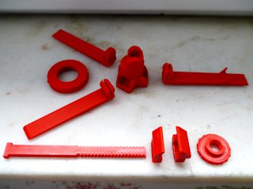
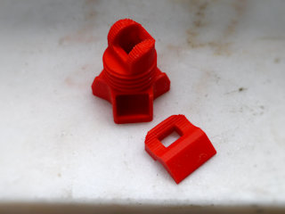

# Zoom Phone Tripod (notched)
*Modified version of LoboCNC's Zoom Phone Tripod, with notched angle for better stability*

### License
[Creative Commons - Attribution - Share Alike](https://creativecommons.org/licenses/by-sa/4.0/)

### Attribution
This is a remix of the ‘Zoom Phone Tripod’ by LoboCNC ([Thingiverse thing:4432319](https://www.thingiverse.com/thing:4432319)).

### Gallery

[🔎](images/tripod1.jpg) [🔎](images/tripod2.jpg) [🔎](images/tripod3.jpg) [🔎](images/tripod4.jpg) [🔎](images/tripod5.jpg) [🔎](images/tripod6.jpg) [🔎](images/tripod-parts.jpg) [🔎](images/tripod-newparts.jpg)

## Description and Instructions

This is a modified version of LoboCNC's *Zoom Phone Tripod,* a small portable and collapsable tripod for smartphones, small tablets, or any other small flat object. Only 2 parts have been modified in this remix: the base and lower jaw (and also an optional longer version of the mounting post). Interlocking notches have been added, such that the angle can be effectively locked by sufficiently tightening the upper knob. This avoids the risk of the phone slowly wandering and you becoming reduced to a talking hairdo during video calls. The notches are at 7.5 degree angles, offering quite fine-grained locking steps.

Use the XL post for mounting phones in portrait orientation, or for larger devices. Stability in such cases may be trickier, so make sure to sufficiently spread the legs, or keep the device at a steeper angle.

Features (from the original description):
- The three legs simply snap into sockets in the tripod base
- A screw ring is use to set the leg angle anywhere from collapsed to fully open
- The threaded post, when fully extended, can tilt forward and backwards by 30 degrees. When stowed in the base, it can be held in place by a clip on one of the legs.
- The screw knob at the top both clamps your phone in place between the jaws and also sets the friction level for tilting forward and backwards. In this remix, sufficiently tightening the knob will effectively lock the tilt angle.
- Both jaws and the leg with the clip have tiny break-away support structures built-in. No need to turn on your slicer's supports. Just print as-in and break away.

### Printing

This is designed to be printed at 0.2 mm layers. I recommend to use 3 perimeters for maximum strength, infill is not important if you do this.

* If you print a whole new tripod: print one of each file except `xtra_separate_lower_jaw.stl`. Print the `tripod_leg_plain.stl` file twice.
* If you already printed the original tripod and want to upgrade it to the notched version: only print `tripod_base_notched.stl` and `xtra_separate_lower_jaw.stl`.

You can choose to print either or both of the `tripod_post` files depending on how you want to mount your device. The XL post allows to mount most phones in both portrait as well as landscape orientations, but if you're only going to mount your phone in landscape, the shorter post keeps the tripod more compact and portable when folded.

If it is hard or impossible to screw the knobs on their threads, it simply means you have work to do on making your printer print accurately. Any issues filed about this will be closed immediately as invalid: this model is certain to work fine on a well-calibrated printer. (As a workaround, you could scale up the ring in the XY directions.)

### Post-printing

The leg with the clip and the jaws all have tiny built-in support structures with clearances that require slicing with exactly 0.2mm layer height. Just break away these small pieces after printing.

Assembly is straightforward - just use the photos as a guide.

## Updates

### 2020/08/01
Added XL post for portrait orientation or larger devices.

## Tags
`Phone_Stand`, `tripod`
